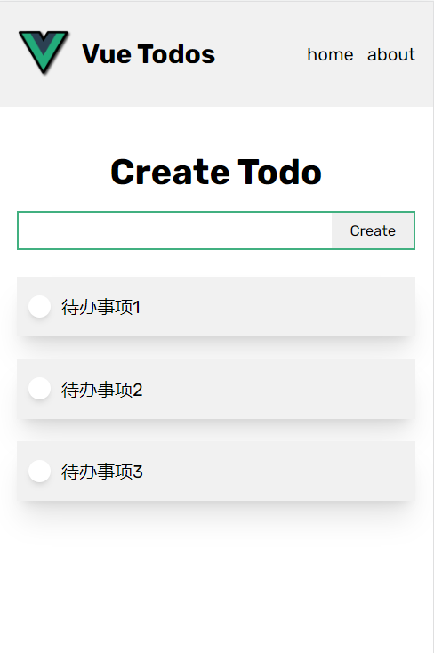

# vue-todos

This template should help get you started developing with Vue 3 in Vite.

## Project Setup

```sh
npm install
```

### Compile and Hot-Reload for Development

```sh
npm run dev
```



vue3 + localStorage 的练习项目

视频链接 <https://www.youtube.com/watch?v=KTFH4P8unUQ>

原作者github <https://github.com/johnkomarnicki/vue-3-crash-course/tree/section-14>
